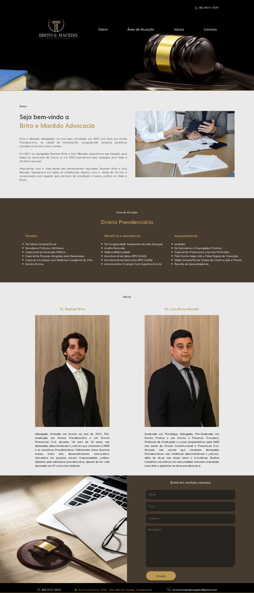

# Brito e Macêdo Advogados

# Sobre o projeto
O projeto consiste em um site responsivo, formulado para uma sociedade de advogados com o objetivo de visibilidade do Escritório, de conhecimento dos sócios e de informação acerca dos principais serviços prestados, proporcionando o contato com clientes em potencial.

## Layout 

# Tecnologias utilizadas

- HTML / CSS 

# Page
 pedromachado07.github.io/advogados/

# Autor

Pedro Brasil Machado

https://www.linkedin.com/in/pedrobmachado

